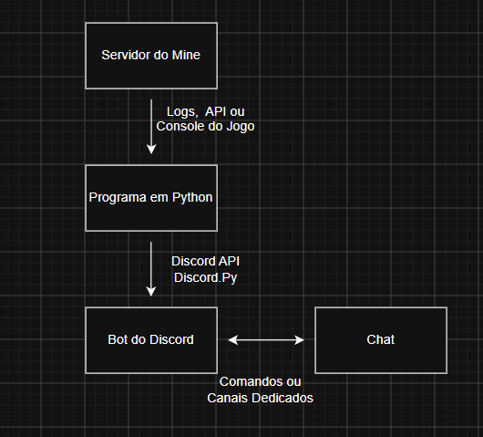

# Discord Minecraft Integration Bot

Criação de um Bot de Discord com integração ao servidor de minecraft, desenvolvido em Python
 

---

## A criação do Bot
O projeto tem como objetivo principal, centrlizar o gerenciamento do servidor de Minecraft através do Discord, oferecendo monitoramento, comunicação entre plataformas e ferramentas administrativas.

The Project has it's main objective to centralize and the management of a Minecraft Server through Discord, Offering Visualization and Communication in between apps and Administrative tools.

## Funcionalidades

- Integração do chat do jogo ao Discord
- Mostrar Usuários Ativos
- Contar os dias do mundo
- Logs
- Status do Servidor

## Tecnologias

- Python
- Discord API
- PaperMC
- Docker (Introdução futura)

## Arquitetura e Estrutura do projeto

- Diagrama de Funcionamento

